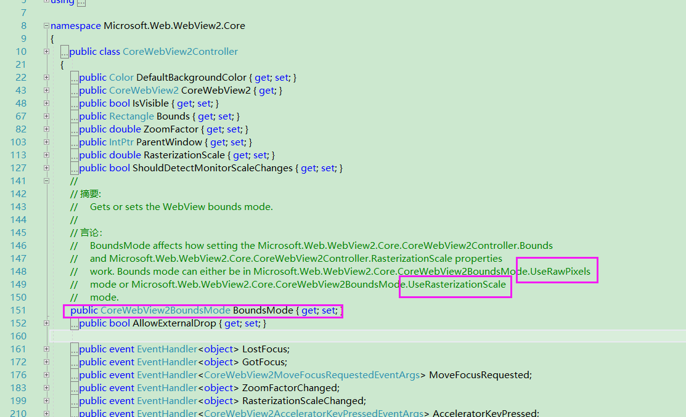

#### 必备条件
Microsoft Edge (Chromium 在 windows 10、windows 8.1 或 windows 7 上安装了) 
Visual Studio 2017 或更高版本

测试版本 1.0.1056-prerelease
测试框架：WPF
操作系统：Win10

Nuget安装：Microsoft.Web.WebView2  

Xaml引入：


```
xmlns:wv2="clr-namespace:Microsoft.Web.WebView2.Wpf;assembly=Microsoft.Web.WebView2.Wpf"

<wv2:WebView2 Name="webView"/>

```

#### MP4 视频支持

测试网址  http://html5test.com/ WebView2支持H264的视频解码，MP4视频可正常播放


#### 截取长图

https://github.com/MicrosoftEdge/WebView2Feedback/issues/529

使用CallDevToolsProtocolAsync调用DevTool的方法可以截取渲染界面大小的图，长图未找到实现方案


```csharp
            string r3 = await webView.CoreWebView2.CallDevToolsProtocolMethodAsync("Page.captureScreenshot", "{}");
            JObject o3 = JObject.Parse(r3);
            JToken data = o3["data"];
            string data_str = data.ToString();
            MemoryStream ms = new MemoryStream(Convert.FromBase64String(data_str));
            Bitmap bmp = new Bitmap(ms);
            ms.Close();
            bmp.Save("screenshot.png");

            bmp.Dispose();
```


#### 自定义缓存路径 
https://docs.microsoft.com/en-us/microsoft-edge/webview2/concepts/user-data-folder

```csharp
 string userDataFolder = Path.Combine(System.Environment.CurrentDirectory, "Catches");
            Task<CoreWebView2Environment> task = CoreWebView2Environment.CreateAsync(browserExecutableFolder, userDataFolder, options);

```

#### UserAgent 模拟手机
https://github.com/MicrosoftEdge/WebView2Feedback/issues/122

```csharp

private const string UserAgent = "Mozilla/5.0 (Windows NT 10.0; Win64; x64) AppleWebKit/537.36 (KHTML, like Gecko) Chrome/85.0.4183.102 Safari/537.36";
private const string MobileUserAgent = "Mozilla/5.0 (Linux; Android 5.0; SM-G900P Build/LRX21T) AppleWebKit/537.36 (KHTML, like Gecko) Chrome/85.0.4183.102 Safari/537.36";


       // 初始化设置

        public MainWindow()
        {
            InitializeComponent();

            webView.NavigationStarting += WebView_NavigationStarting;
            webView.NavigationCompleted += WebView_NavigationCompleted;

            CoreWebView2EnvironmentOptions options = new CoreWebView2EnvironmentOptions($"--user-agent=\"{MobileUserAgent}\"", null, null);
            string browserExecutableFolder = null;
            string userDataFolder = Path.Combine(System.Environment.CurrentDirectory, "Catches");
            Task<CoreWebView2Environment> task = CoreWebView2Environment.CreateAsync(browserExecutableFolder, userDataFolder, options);
            TaskScheduler ui = TaskScheduler.FromCurrentSynchronizationContext();
            task.ContinueWith(t =>
            {
                var _environment = task.Result;
                Task coreTask = webView.EnsureCoreWebView2Async(_environment);
                coreTask.ContinueWith(t2 =>
                {
                    //If needed do something here 
                }, ui);
            }, ui);
        }


       // 针对现有webview更改，AOI切换不同的SegmentType

        private void btnMobile_Click(object sender, RoutedEventArgs e)
        {
            webView.CoreWebView2.Settings.UserAgent = MobileUserAgent;
        }

        private void btnDesktop_Click(object sender, RoutedEventArgs e)
        {
            webView.CoreWebView2.Settings.UserAgent = UserAgent;
        }

```

#### 设备尺寸 （实验设计添加网页刺激 最小宽，固定宽，固定宽高）屏幕方向（横屏、竖屏）

使用DevTool可以，与Cef相同方案

**测试网址** : 见附件

```csharp
        private async void UpdateSize(double width, double height)
        {
            if (webView == null || webView.CoreWebView2 == null)
                return;

            double pageScale = this.ActualWidth / width;
            var dict = new Dictionary<string, object>
                {
                    { "width", width },
                    { "height", height },
                    { "deviceScaleFactor", 0 },
                    { "mobile", true },
                    { "scale", pageScale }
                };

            string jsonString = System.Text.Json.JsonSerializer.Serialize(dict);
            string res = await webView.CoreWebView2.CallDevToolsProtocolMethodAsync("Emulation.setDeviceMetricsOverride", jsonString);
        }

        // 采用这种，包含横竖屏
        private async void UpdateSizeDirection(int width, int height)
        {
            if (webView == null || webView.CoreWebView2 == null)
                return;

            double pageScale = this.ActualWidth / width;
            bool isLandscape = false;

            var dict = new System.Collections.Generic.Dictionary<string, object>();
            dict.Add("width", width);
            dict.Add("height", height);
            dict.Add("deviceScaleFactor", 0);
            dict.Add("mobile", true);
            dict.Add("scale", pageScale);

            var screenDict = new System.Collections.Generic.Dictionary<string, object>();
            screenDict.Add("type", isLandscape ? "landscapePrimary" : "portraitPrimary");
            screenDict.Add("angle", isLandscape ? 90 : 0);
            dict.Add("screenOrientation", screenDict);

            string jsonString = System.Text.Json.JsonSerializer.Serialize(dict);
            string res = await webView.CoreWebView2.CallDevToolsProtocolMethodAsync("Emulation.setDeviceMetricsOverride", jsonString);
        }

```

#### 鼠标模拟Touch，使用DevTool

https://github.com/MicrosoftEdge/WebView2Feedback/issues/732
https://chromedevtools.github.io/devtools-protocol/tot/Emulation/#method-setTouchEmulationEnabled

**测试网址** : 见附件

**注意：**cef使用SetEmitTouchEventsForMouseAsync兴趣区Draw模式鼠标无法显示十字，待验证Edge

```csharp

    public class MouseToTouchParam
    {
        public bool enabled { get; set; }

        public string configuration { get; set; }
    }

        private async void WebView_NavigationCompleted(object sender, CoreWebView2NavigationCompletedEventArgs e)
        {
            MouseToTouchParam param = new MouseToTouchParam() { enabled = true, configuration = true ? "mobile" : "desktop" };
            string jsonString = System.Text.Json.JsonSerializer.Serialize(param);
            var res = await webView.CoreWebView2.CallDevToolsProtocolMethodAsync("Emulation.setEmitTouchEventsForMouse", jsonString);
        }

```

#### 获取favicon


```csharp
        public async Task<string> GetIconPath()
        {
            string js = " window.location.protocol + \"//\" + window.location.host + \"/favicon.ico\"";
            string path = await webView.CoreWebView2.ExecuteScriptAsync(js);

            return path;
        }

```

#### Custom Protocol Scheme (相对于直接访问file://的形式，会有3s左右的卡顿)

https://github.com/MicrosoftEdge/WebView2Feedback/issues/1825
https://docs.microsoft.com/en-us/dotnet/api/microsoft.web.webview2.core.corewebview2.setvirtualhostnametofoldermapping?view=webview2-dotnet-1.0.992.28


```csharp
webView.CoreWebView2.SetVirtualHostNameToFolderMapping("ergolab", @"E:\图片\鼠标移动分析demo原型", CoreWebView2HostResourceAccessKind.DenyCors);

webView.Source = new Uri("https://ergolab/index.html");

```

#### js 回调

js 回调，需要修改对应的html的调用方式
https://docs.microsoft.com/en-us/dotnet/api/microsoft.web.webview2.core.corewebview2.addhostobjecttoscript?view=webview2-dotnet-1.0.1056-prerelease


```csharp
const bridge = chrome.webview.hostObjects.bridge;
```

::: tip
js回调参数不支持dynamic  string可以，需要将object参数改为json字符串
:::

#### 尺寸

最小宽、固定宽、固定宽高，cef 设置对应的浏览器的宽高即可改变浏览器内部尺寸，webview2 设置宽高后，浏览器内部仍为显示的实际像素（比如，显示区域500*500，设置为1000*1000，viewBox缩放为500*500，浏览器内部window.outterWidth仍为500，cef为1000）

解决方案：
SetDeviceMetricsOverrideAsync 设置的宽高改为1000*1000，可解决内部尺寸问题

仍存在问题：内容未居中显示，个别缩放情况会有白边出现


https://docs.microsoft.com/en-us/microsoft-edge/webview2/reference/win32/icorewebview2controller?view=webview2-1.0.1020.30#put_bounds
https://github.com/MicrosoftEdge/WebView2Feedback/issues/984





CanGoForward CanGoBack 策略变更

百度首页-> 推荐新闻页 cef 后退按钮可用，webview2 不行

webview2 暂时没找过可用的具体规则


浏览器默认鼠标可以缩放html，实验设计需要控制人为不可缩放

this.CoreWebView2.Settings.IsZoomControlEnabled = false; // 无效果

## 测试尺寸文件

```html
<!DOCTYPE html>
<html lang="en">

<head>
    <meta charset="UTF-8">
    <meta name="viewport" content="width=device-width, initial-scale=1.0">
    <title>Document</title>
    <style>
        body {
            display: flex;
            flex-direction: column;
            align-items: center;
            margin: 0;
            padding: 0;
            justify-content: center;
            height: 100vh;
            width: 100vw;
            background: lightseagreen;
        }

        p {
            font-size: x-large;
            min-height: 3rem;
        }
    </style>
</head>

<body>
    <p id="size">

    </p>
	  <p id="scale">

    </p>
    <p id="agent">

    </p>
    <p id="touch">

    </p>
    <p id="mouse">

    </p>
    <p id="click">

    </p>

    <script>
        document.querySelector('#agent').innerText = navigator.userAgent
        let pTouch = document.querySelector('#touch');
        let pMouse = document.querySelector('#mouse');
        let pClick = document.querySelector('#click');
        let pSize = document.querySelector('#size');
		let pScale = document.querySelector('#scale');

        document.body.addEventListener('touchstart', handle)
        document.body.addEventListener('touchend', handle)
        document.body.addEventListener('touchcancel', handle)
        document.body.addEventListener('touchmove', handle)

        document.body.addEventListener('mousedown', mousehandle)
        document.body.addEventListener('mouseup', mousehandle)
        document.body.addEventListener('mousemove', mousehandle)

        document.body.addEventListener('click', clickhandle)

        pSize.innerText = `${window.innerWidth} * ${window.innerHeight}`
		pScale.innerText=detectZoom();

        window.onresize=(e)=>{
            pSize.innerText = `${window.innerWidth} * ${window.innerHeight}`
			
			pScale.innerText=detectZoom();
            // console.log(e);
        };


        function handle(e) {
            // console.log(e);
            pTouch.innerText = `${e.type} `
        }

        function mousehandle(e) {
            // console.log(e);
            pMouse.innerText = `${e.type} `
        }

        function clickhandle(e) {
            pClick.innerText = `${e.type} `
            setTimeout(() => {
                pClick.innerText = ''
            }, 500);
        }
		
		function detectZoom (){
		var ratio = 0,
		screen = window.screen,
		ua = navigator.userAgent.toLowerCase();
		if (window.devicePixelRatio !== undefined) {
		ratio = window.devicePixelRatio;
		}
		else if (~ua.indexOf('msie')) {
		if (screen.deviceXDPI && screen.logicalXDPI) {
		ratio = screen.deviceXDPI / screen.logicalXDPI;
		}
		}
		else if (window.outerWidth !== undefined && window.innerWidth !== undefined) {
		ratio = window.outerWidth / window.innerWidth;
		}
		if (ratio){
		ratio = Math.round(ratio * 100);
		}
		return ratio;
		};

    </script>

</body>

</html>

```
