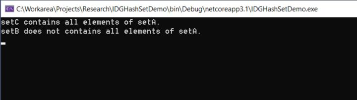

### 从 HashSet 中查找一个元素

如果想判断某一个元素是否在 HashSet 内，建议使用 Contains 进行判断，代码如下：

```
static void Main(string[] args)
        {
            HashSet<string> hashSet = new HashSet<string>();
            hashSet.Add("A");
            hashSet.Add("B");
            hashSet.Add("C");
            hashSet.Add("D");
            if (hashSet.Contains("D"))
                Console.WriteLine("The required element is available.");
            else
                Console.WriteLine("The required element isn’t available.");
            Console.ReadKey();
        }
```
### HashSet中的元素唯一性

如果你向 HashSet 中插入重复的元素，它的内部会忽视这次操作而不像别的集合一样抛出异常，接下来展示一下代码：


```
  static void Main(string[] args)
        {
            HashSet<string> hashSet = new HashSet<string>();
            hashSet.Add("A");
            hashSet.Add("B");
            hashSet.Add("C");
            hashSet.Add("D");
            hashSet.Add("D");
            Console.WriteLine("The number of elements is: {0}", hashSet.Count);
            Console.ReadKey();
        }
```
当你执行了这个程序，输出结果如下图：


### 现在可以考虑一下下面的代码段，它展示了重复的元素是如何被剔除的。


```
 static void Main(string[] args)
        {
            string[] cities = new string[] {
                "Delhi",
                "Kolkata",
                "New York",
                "London",
                "Tokyo",
                "Washington",
                "Tokyo"
            };
            HashSet<string> hashSet = new HashSet<string>(cities);
            foreach (var city in hashSet)
            {
                Console.WriteLine(city);
            }
        }
```
当你执行完上面的程序，重复的城市名称已经被移除了。

### 从 HashSet 中移除元素

从HashSet 中删除某一个元素可以调用 Remove 方法，它的语法结构如下：

```
string[] list= new string[] {
                "A",
                "B",
                "C",
                "D",
                "E",
                "F",
                "G"
            };
 HashSet<string> hashSet = new HashSet<string>(list);
string item = "D";
if(hashSet.Contains(item))
{
   hashSet.Remove(item);
}

//删除 HashSet 中的所有元素
hashSet.Clear();
```
### HashSet 的 set操作

HashSet提供了非常多的方法用于 set集合 操作上，比如说：IntersectWith, UnionWith, IsProperSubsetOf, ExceptWith, 和 SymmetricExceptWith

- IsProperSubsetOf
这个 IsProperSubsetOf 用于判断 HashSet 是否为某一个集合的完全子集，可以看下面的例子：

```
HashSet<string> setA = new HashSet<string>() { "A", "B", "C", "D" };
HashSet<string> setB = new HashSet<string>() { "A", "B", "C", "X" };
HashSet<string> setC = new HashSet<string>() { "A", "B", "C", "D", "E" };
if (setA.IsProperSubsetOf(setC))
   Console.WriteLine("setC contains all elements of setA.");
if (!setA.IsProperSubsetOf(setB))
   Console.WriteLine("setB does not contains all elements of setA.");
```
如果你执行了上面这个程序，你会在控制台上看到如下的输出：


- UnionWith
UnionWith方法常用于集合的合并，比如说下面的代码：

```
HashSet<string> setA = new HashSet<string>() { "A", "B", "C", "D", "E" };
HashSet<string> setB = new HashSet<string>() { "A", "B", "C", "X", "Y" };
setA.UnionWith(setB);
foreach(string str in setA)
{
   Console.WriteLine(str);
}
```
当你执行完上面的代码，SetB 集合会被 SetA 集合吞掉，最后 SetA 集合将会是包括："A", "B", "C", "D", "E", "X", and "Y" 。

- IntersectWith
IntersectWith 方法常用于表示两个 HashSet 的交集，下面的例子或许会让你更加理解：

```
HashSet<string> setA = new HashSet<string>() { "A", "B", "C", "D", "E" };
HashSet<string> setB = new HashSet<string>() { "A", "X", "C", "Y"};
setA.IntersectWith(setB);
foreach (string str in setA)
{
    Console.WriteLine(str);
}
```
当你运行了上面的这段程序，只有两个 HashSet 中都存在的元素才会输出到控制台中，输出结果如下所示：


- ExceptWith
ExceptWith 方法表示数学上的减法操作，这个时间复杂度是 O(N)，假定你有两个HashSet 集合，分别叫 setA 和 setB，并且用了下面的语句。

```
setA.ExceptWith(setB);

```
它返回的元素为： setA中有，setB中没有 的最终结果，如果还不明白的话,使用如下代码辅助理解：

```
HashSet<string> setA = new HashSet<string>() { "A", "B", "C", "D", "E" };
HashSet<string> setB = new HashSet<string>() { "A", "X", "C", "Y" };
setA.ExceptWith(setB);
foreach (string str in setA)
{
   Console.WriteLine(str);
}
```
当你执行了上面这段程序，元素 B,D,E 将会输出到控制台上。


- SymmetricExceptWith
 SymmetricExceptWith 方法常用于修改一个 HashSet 来存放两个 HashSet 都是唯一的元素，换句话说，我要的就是两个集合都不全有的元素，如果还不明白的话，考虑下面的代码段：

```
HashSet<string> setA = new HashSet<string>() { "A", "B", "C", "D", "E" };
HashSet<string> setB = new HashSet<string>() { "A", "X", "C", "Y" };
setA.SymmetricExceptWith(setB);
foreach (string str in setA)
{
  Console.WriteLine(str);
}
```
当你执行完上面的代码，你会发现，setA中有而setB中没有 和 setB中有而setA中没有的元素将会输出到控制台中。


我们知道数组的平均复杂度是 O(N)，这里的 n 表示数组里的元素数量，而访问 HashSet 中的某一个元素，它的复杂度为 O(1)，这个常量复杂度就决定了 HashSet 在快速检索 和执行 set集合 操作上是一个非常好的选择，你也可以使用 List 去存储某些有指定顺序的元素，同时也可以包含重复的值。