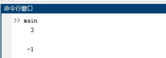
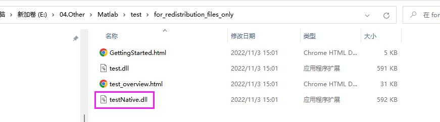

## 环境

- VS2022

::: tip
对于没有安装matlab的电脑，需要安装对应打包版本的运行时[runtime](https://ww2.mathworks.cn/products/compiler/matlab-runtime.html), 这里要跟打包的版本保持一致
:::

## Matlab函数打包成DLL

### 编写函数

用matlab写一个函数test,计算两个数值的和和差值, 具体代码如下

```matlab
% test.m
function [x1,x2] = test(a,b)
x1 = a + b;
x2 = a - b;
end

% mian.m
[sum,diff]=test(1,2);
disp(sum)
disp(diff)
```

运行效果



### 打包Dll
matlab命令行输入```deploytool```并回车，调出 Matlab Compiler打包工具箱。选择Library Compiler。


选择一个文件夹将项目保存到本地，成功后可以看到文件结构如下，```testNative.dll```就是我们.NET可以调用用的Dll。




## .NET引用Matlab函数

### 支持的.NET版本
- Microsoft® .NET Framework 4.x
- Microsoft .NET Core 2.0 or higher
- Microsoft .NET 5.0 or higher

### 目标平台
- x64

### 需要添加的引用
- MWArray.dll （[安装目录]\toolbox\dotnetbuilder\bin\win64\v4.0）
- testNative.dll （[打包生成目录]\for_redistribution_files_only）

### 调用代码
```csharp {6,9-11}
using MathWorks.MATLAB.NET.Arrays;
using testNative;

// 对于数字而言，可以直接调用
Test test = new Test();
var res = test.test(1, 1, 2);

// 也可以转成MWNumericArray，调用
MWNumericArray a = new MWNumericArray(1);
MWNumericArray b = new MWNumericArray(4);
var res = test.test(1, a, b);

Console.ReadKey();
```
::: tip

- C#首次调用dll中的函数，会有几秒钟的延迟，但是再调用的就不会出现这种现象
- 接口中的```numArgsOut```参数个数传递时是从0开始的，比如方法中的参数是2个，这里传值1就可以了

:::

## C# 调用Matlab训练的模型示例

## Matlab

```matlab{9-11,20}
% predictFcn.m
function result = predictFcn(inputData)
if ismatrix(inputData) && size(inputData,2) == 30
    T = inputData;
else
    error('输入参数必须为 30 列矩阵');
end

fileData = load('Model.mat');
model = fileData.trainedModel;
result = model.predictFcn(T);
end

% mian.m
clc
clear
data=xlsread("testData.xlsx");
label=data(:,1); % 第一列是标签列
testdata=data(:,2:end); % 测试数据从第二列开始
result=predictFcn(testdata);
disp(result);
```

预测方法也可以替换成下面这个版本

``` matlab
function [label,scores]=predictFcn(inputData)
load Model.mat
saveLearnerForCoder(trainedModel.ClassificationSVM,'SVM ')
compactMdl=loadLearnerForCoder("SVM .mat");
[label,scores]=predict(compactMdl,inputData);
end
```

## C#

```csharp {7-9}
using MathWorks.MATLAB.NET.Arrays;
using predictFcnNative;

Model model = new Model();
// 这里构建一个2*30的数据传递给预测方法
double[,] data = new double[2, 30]; 
MWNumericArray testArray = new MWNumericArray(data);
var res = model.predictFcn(testArray);

if (res is double[,] array)
{
    foreach (var item in array)
        Console.WriteLine(item);
}

Console.ReadKey();
```

## 参考链接
- [C#调用 Matlab 函数](https://zhuanlan.zhihu.com/p/401106292)
- [MATLAB Compiler SDK .NET Target Requirements](https://www.mathworks.com/help/compiler_sdk/dotnet/matlab-builder-ne-prerequisites.html)
