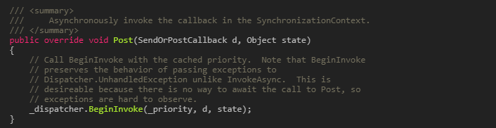

## 前言

在前面多线程学习中我们学习到了 Task.Wait()等待任务完成方法，在实际使用过程中我们会遇到死锁的问题。

### 什么情况下会发生死锁？

1. 调用 Wait() 或 Result 的代码位于 UI 线程；
2. Task 的实际执行在其他线程，且需要返回 UI 线程。

### 造成死锁的原因

UWP、WPF、Windows Forms 程序的 UI 线程都是单线程的。为了让使用了 async/await 的代码像使用同步代码一样简单，WPF 程序的 Application 类在构造的时候会将主 UI 线程 Task 的同步上下文设置为 DispatcherSynchronizationContext 的实例，这在我的另一篇文章 Task.Yield 中也有过说明。

当 Task 的任务结束时，会从 AsyncMethodStateMachine 中调用 Awaiter 的 OnComplete() 方法，而 await 后续方法的执行靠的就是 OnComplete() 方法中一层层调用到 DispatcherSynchronizationContext 里的 Post 方法：

这里就是问题的关键！！！

如果 \_dispatcher.BeginInvoke(\_priority, d, state); 这句代码在后台线程，那么此时 UI 线程处于 Wait()/Result 调用中的阻塞状态，BeginInvoke 中的任务是无论如何也无法执行到的！于是无论如何都无法完成这个 Post 任务，即无论如何也无法退出此异步任务的执行，于是 Wait() 便无法完成等待……死锁……

这里给出最简复现的例子代码：

```cs
DoAsync().Wait();
async Task DoAsync()
{
    await Task.Run(() => { });
}
```

无论是 WPF 还是 UWP，只要在 UI 线程上调用上述代码，必然死锁！

### 什么情况下不会产生死锁？

StorageFolder.GetFolderFromPathAsync("") 和 StorageFolder.GetFolderFromPathAsync("") 这两个方法并不会在后台线程执行！
读写文件，访问网络，这些 IO 阻塞的操作执行时，里面根本就没有线程，详情请阅读：[There Is No Thread](https://blog.stephencleary.com/2013/11/there-is-no-thread.html)。
还有另一些操作，也没有后台线程的参与，于是也不存在从后台线程回到主线程导致死锁的情况。如 [Task.Yield](http://blog.walterlv.com/post/yield-in-task-dispatcher.html#taskyield)，还有 [InvokeAsync](http://blog.walterlv.com/post/dotnet/2017/09/26/dispatcher-invoke-async.html)，它们也不会造成死锁。
另外，如果是控制台程序，或者一个普通的非 UI 线程，其 SynchronizationContext 为 null，那么异步任务执行完后不需要回到原有线程，也不会造成死锁。

**总结不会造成死锁的充分条件：**

1. 异步操作执行完后不需要回到原有线程（例如非 UI 线程和控制台线程）；
2. 异步操作不需要单独的线程执行任务。

**如何避免死锁？**

1. 在 UI 线程，如果使用了 async/await，就尽量不要再使用 Task.Wait()/Task.Result 了，就一直异步一条路走到黑好了（微软称其为 Async All the Way）。
2. 如果可能，尽量在异步任务后添加 .ConfigureAwait(false)；这样，异步任务后面继续执行的代码就不会回到原 UI 线程了，而是直接从线程池中再取出一个线程执行；这样，即便 UI 线程后续可能有别的原因造成阻塞，也不会产生死锁了。

## ConfigureAwait 作用

Configures an awaiter used to await this System.Threading.Tasks.Task.
配置一个等待器，用于等待这个 System.Threading.Tasks.Task。
默认异步方法调用 ConfigureAwait(true),异步调用前后是同一个调用者
ConfigureAwait(false),异步调用后，**不再回到调用线程，继续使用新开启的线程执行后面的代码**

## ConfigureAwait(false)能做什么？

默认情况下，当您使用 async/await 时，它将在开始请求的原始线程上继续运行(状态机)。但是，如果当前另一个长时间运行的进程已经接管了该线程，那么你就不得不等待它完成。要避免这个问题，可以使用 ConfigureAwait 的方法和 false 参数。当你用这个方法的时候，**这将告诉 Task 它可以在任何可用的线程上恢复自己继续运行**，而不是等待最初创建它的线程。这将加快响应速度并避免许多死锁。

但是，这里有一点点损失。当您在另一个线程上继续时，线程同步上下文将丢失,因为状态机改变。这里最大的损失是你会失去归属于线程的 Culture 和 Language，其中包含了国家语言时区信息，以及来自原始线程的 HttpContext.Current 之类的信息，因此，如果您不需要以此来做多语系或操作任何 HttpContext 类型设置，则可以安全地进行此方法的调用。注意：如果需要 language/culture，可以始终在 await 之前存储当前相关状态值，然后在 await 新线程之后重新应用它

## 总结

### 什么情况下使用 ConfigureAwait(false)

- [ ] 在 UI 线程中调用异步方法时，请使用 ConfigureAwait(false)
- [ ] 如果要编写通用库代码，请使用 ConfigureAwait(false)

### .NET Standard 与 ConfigureAwait(false)

在.NETCore 中，微软删除了导致我们在任何地方都需要 ConfigureAwait(false)的 SynchronizationContext。因此，ASP.NETCore 应用程序在技术上不需要任何 ConfigureAwait(false)逻辑，因为它是多余的。但是，如果在开发有一个使用.NETStandard 的库，那么强烈建议仍然使用.ConfigureAwait(false)。在.NETCore 中，这自动是无效的。但是如果有.NETFramework 的人最终使用这个库并同步调用它，那么它们将会遇到一堆麻烦。但是随着.NET5 是由.NETCore 构建的，所以未来大多都是.NetCore 调用.Netstadard，你如果不准备让.NetFramework 调用你的 standard 库，大可不必兼容。

### ConfigureAwait(false) 贯穿始终

如果同步调用有可能调用您的异步方法，那么在整个调用堆栈的每个异步调用上，您都将被迫设置. configureAwait (false) !如果不这样做，就会导致另一个死锁。这里的问题是，每个 async/ await 对于调用它的当前方法都是本地的。因此，调用链的每个异 async/await 都可能最终在不同的线程上恢复。如果一个同步调用一路向下，遇到一个没有 configurewait(false)的任务，那么这个任务将尝试等待顶部的原始线程完成，然后才能继续。虽然这最终会让你感到心累，因为要检查所有调用是否设置此属性。

- [学习链接 1](https://docs.microsoft.com/zh-cn/dotnet/fundamentals/code-analysis/quality-rules/ca2007?view=vs-2019#when-to-suppress-warnings)
- [学习链接 2](https://devblogs.microsoft.com/dotnet/configureawait-faq/)
- [学习链接 3](https://github.com/Microsoft/vs-threading/blob/master/doc/cookbook_vs.md#should-i-await-a-task-with-configureawaitfalse)
- [学习链接 4](https://www.cnblogs.com/xiaoxiaotank/p/13529413.html)

## Async Await

简单了解 Async Await 使用
async 用来修饰方法，表明这个方法是异步的，声明的方法的返回类型必须为：void，Task 或 Task< TResult >。
await 必须用来修饰 Task 或 Task< TResult >，而且只能出现在已经用 async 关键字修饰的异步方法中。

**使用**

1. await 后面接一个会 return new promise 的函数并执行它
2. await 只能放在 async 函数里

[Async Await 使用参考 1](https://www.cnblogs.com/zhaoshujie/p/11192036.html)
