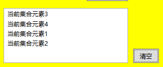
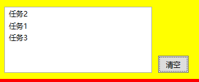

以**异步方式遍历**内部语句块，Parallel 调用之间为同步关系，**使用 Parallel 循环时方法并行但顺序不固定**。

## 常用方法

- Parallel.For
  for 方法，主要用于处理针对数组元素的并行操作

  ```cs
  private void PatallelFor()
  {
    int[] numberArray = new int[] { 1, 2, 3, 4 };
    Parallel.For(0, numberArray.Length, (i) =>
    {
        //后台线程直接修改页面控件属性会报错，已经有线程占用，要异步修改
        UserInfoListBox.Dispatcher.BeginInvoke((Action)delegate ()
        {
            UserInfoListBox.Items.Add($"针对数组索引{i}对应的那个元素{numberArray[i]}");
        });
    });
  }
  ```

输出结果，并不是按照数组顺序的，所以如果我们的输出必须是同步的或者必须是顺序的，则不应使用 Parallel 方式。


- Parallel.ForEach
  forEach 的独到之处就是可以将数据进行分区，每一个小区内实现串行计算。

  ```cs
  private void PatallelForeach()
  {
    int[] numberArray = new int[] { 1, 2, 3, 4 };
    Parallel.ForEach(numberArray, num =>
    {
        //后台线程直接修改页面控件属性会报错，已经有线程占用，要异步修改
         UserInfoListBox.Dispatcher.BeginInvoke((Action)delegate ()
         {
            UserInfoListBox.Items.Add($"当前集合元素{num}");
        });
    });
  }
  ```

Foreach 执行效果同 For 一样，并行顺序不固定，所以想要输出结果为同步或顺序的话，不应使用 Parallel 方式。



- Parallel.Invoke

```cs
private void PatalledInvoke()
{
    Parallel.Invoke(() =>
    {
        UserInfoListBox.Dispatcher.BeginInvoke((Action)delegate ()
        {
            UserInfoListBox.Items.Add("任务1");
        });
    },
    () =>{
        UserInfoListBox.Dispatcher.BeginInvoke((Action)delegate ()
        {
            UserInfoListBox.Items.Add("任务2");
        });
    },
    () =>{
        UserInfoListBox.Dispatcher.BeginInvoke((Action)delegate ()
        {
            UserInfoListBox.Items.Add("任务3");
        });
    });
}
```

同样，由于所有的任务都是并发的，所以它不包含保证先后次序。


