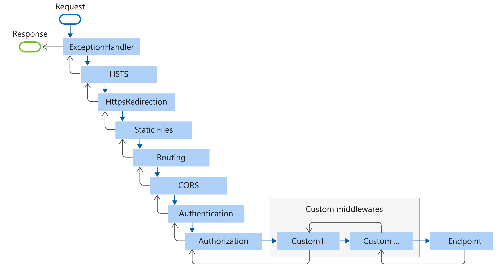
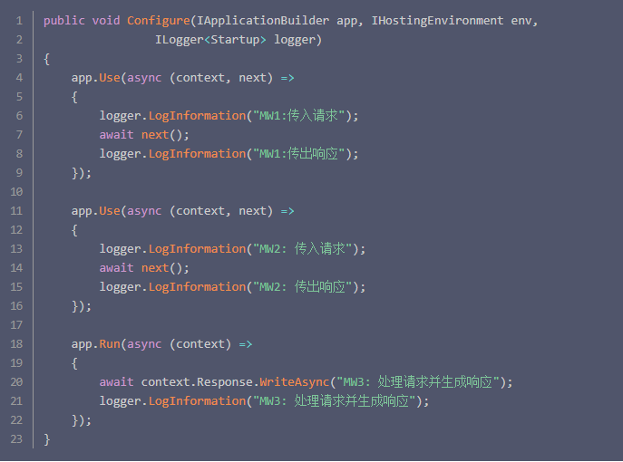
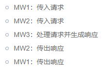

### 什么是中间件？

> 在 ASP.NET Core 中，中间件是一个可以处理 HTTP 请求或响应的软件管道。在 ASP.NET Core 中，中间件具有非常特定的用途。比如，我们可能需要一个中间件验证用户，一个中间件处理错误，一个中间件来提供静态文件，如 Javascript 文件、CSS 文件和图片等。
> 我们在 ASP.NET Core 中使用这些中间件设置请求处理管道，正是这管道决定了如何处理请求。而请求处理管道是由 Startup.cs 文件中的 Configure()方法进行配置的，它也是应用程序启动的一个重要部分。

## 中间件顺序


中间件可以同时处理传入请求和传出响应。因此，中间件可以处理传入请求并将该请求传递给管道中的下一个中间件以进行下一步处理。
Program.cs 中的以下突出显示的代码按照典型的建议顺序增加与安全相关的中间件组件：

```
        var app = context.GetApplicationBuilder();
        var env = context.GetEnvironment();

        if (env.IsDevelopment())
        {
            app.UseDeveloperExceptionPage();
        }

        app.UseAbpRequestLocalization();
        app.UseCorrelationId();
        app.UseStaticFiles();
        app.UseRouting();
        app.UseCors();
        app.UseAuthentication();

        if (MultiTenancyConsts.IsEnabled)
        {
            app.UseMultiTenancy();
        }

        app.UseAuthorization();

        app.UseSignalRJwtToken();

        app.UseSwagger();
        app.UseAbpSwaggerUI(options =>
        {
            //options.SwaggerEndpoint("/swagger/v1/swagger.json", "PsyLAB API");

            SwaggerConsts.ApiInfos.ForEach(x =>
            {
                options.SwaggerEndpoint($"/swagger/{x.UrlPrefix}/swagger.json", x.Name);
            });
            // 模型的默认扩展深度，设置为 -1 完全隐藏模型
            options.DefaultModelsExpandDepth(-1);
            // API文档仅展开标记
            options.DocExpansion(DocExpansion.List);
            // API前缀设置为空
            //options.RoutePrefix = string.Empty;
            // API页面Title
            options.DocumentTitle = "接口文档 - SPSI";

            //options.SwaggerEndpoint("/swagger/v1/swagger.json", "Support APP API");
            var configuration = context.GetConfiguration();
            options.OAuthClientId(configuration["AuthServer:SwaggerClientId"]);
            options.OAuthClientSecret(configuration["AuthServer:SwaggerClientSecret"]);
        });

        app.UseAuditing();
        app.UseAbpSerilogEnrichers();
        app.UseUnitOfWork();
        app.UseConfiguredEndpoints();
        app.Use((httpContext, next) =>
        {
            httpContext.Request.Scheme = "http";
            return next();
        });
```

- 并非所有中间件都完全按照此顺序出现，但许多中间件都会遵循此顺序。 例如：

1. UseCors、UseAuthentication 和 UseAuthorization 必须按显示的顺序出现。
2. UseCors 当前必须在 UseResponseCaching 之前出现。 [详细说明](https://github.com/dotnet/aspnetcore/issues/23218)
3. UseRequestLocalization 必须在可能检查请求区域性的任何中间件（例如 app.UseMvcWithDefaultRoute()）之前出现。
   在某些场景下，中间件的排序有所不同。 例如，高速缓存和压缩排序是特定于场景的，存在多个有效的排序。 例如：

```
app.UseResponseCaching();
app.UseResponseCompression();
```

使用以上的代码，可以通过缓存压缩的响应来减少 CPU 使用量，但可能最终会使用不同的压缩算法（如 Gzip 或 Brotli）来缓存资源的多个表示形式。
以下 Program.cs 代码将为常见应用场景添加中间件组件：

1. 异常/错误处理
   - 当应用在开发环境中运行时：
     - 开发人员异常页中间件 (UseDeveloperExceptionPage) 报告应用运行时错误。
     - 数据库错误页中间件 (UseDatabaseErrorPage) 报告数据库运行时错误。
   - 当应用在生产环境中运行时：
     - 异常处理程序中间件 (UseExceptionHandler) 捕获以下中间件中引发的异常。
     - HTTP 严格传输安全协议 (HSTS) 中间件 (UseHsts) 添加 Strict-Transport-Security 标头。
2. HTTPS 重定向中间件 (UseHttpsRedirection) 将 HTTP 请求重定向到 HTTPS。
3. 静态文件中间件 (UseStaticFiles) 返回静态文件，并简化进一步请求处理。
4. Cookie 策略中间件 (UseCookiePolicy) 使应用符合欧盟一般数据保护条例 (GDPR) 规定。
5. 用于路由请求的路由中间件 (UseRouting)。
6. 身份验证中间件 (UseAuthentication) 尝试对用户进行身份验证，然后才会允许用户访问安全资源。
7. 用于授权用户访问安全资源的授权中间件 (UseAuthorization)。
8. 会话中间件 (UseSession) 建立和维护会话状态。 如果应用使用会话状态，请在 Cookie 策略中间件之后和 MVC 中间件之前调用会话中间件。
9. 用于将 Razor Pages 终结点添加到请求管道的终结点路由中间件（带有 MapRazorPages 的 UseEndpoints）。

### 中间件特点

- 可同时被访问和请求
- 可以处理请求，然后将请求传递给下一个中间件
- 可以处理请求，并使管道短路
- 可以处理传出响应
- 中间件是按照添加的顺序执行的。

### 中间件的工作流程


结果：

流程图


- 所有的请求都会在每个中间件调用 next()方法之前触发。请求按照一定方向依次穿过所有管道
- 当中间件处理请求并产生响应时，请求处理流程在管道中开始反向传递
- 所有的响应都会在每个中间件调用 next()方法之前触发。响应按一定方向依次穿过所有管道。