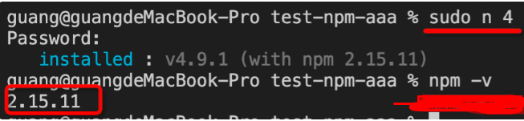
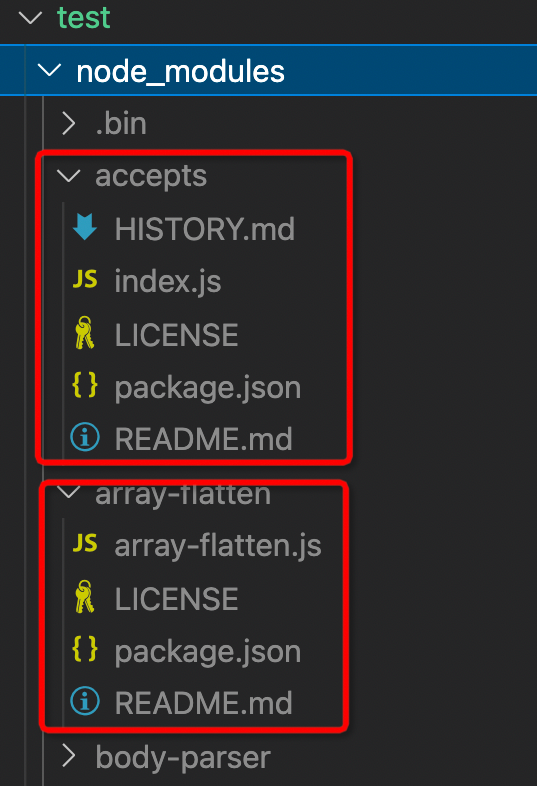
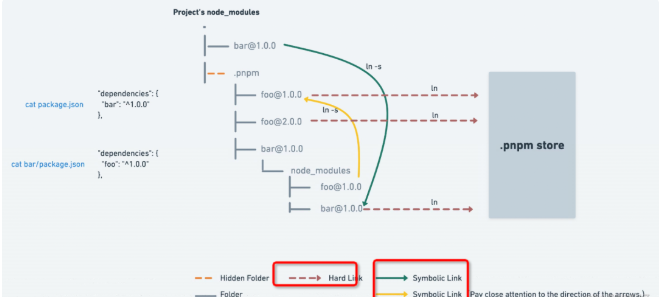

# pnpm

> 大家最近是不是经常听到 pnpm，我也一样。今天研究了一下它的机制，确实厉害，对 yarn 和 npm 可以说是降维打击。那具体好在哪里呢？我们一起来看一下。我们按照包管理工具的发展历史，从 npm2 开始讲起：

用 node 版本管理工具把 node 版本降到 4，那 npm 版本就是 2.x 了。

然后找个目录，执行下 npm init -y，快速创建个 package.json。
然后执行 npm install express，那么 express 包和它的依赖都会被下载下来：

展开 express，它也有 node_modules：

再展开几层，每个依赖都有自己的 node_modules：

也就是说 npm2 的 node_modules 是嵌套的。

这很正常呀？有什么不对么？

这样其实是有问题的，多个包之间难免会有公共的依赖，这样嵌套的话，同样的依赖会复制很多次，会占据比较大的磁盘空间。

这个还不是最大的问题，致命问题是 windows 的文件路径最长是 260 多个字符，这样嵌套是会超过 windows 路径的长度限制的。

当时 npm 还没解决，社区就出来新的解决方案了，就是 yarn：

# yarn

yarn 是怎么解决依赖重复很多次，嵌套路径过长的问题的呢？

铺平。所有的依赖不再一层层嵌套了，而是全部在同一层，这样也就没有依赖重复多次的问题了，也就没有路径过长的问题了。

我们把 node_modules 删了，用 yarn 再重新安装下，执行 yarn add express：

这时候 node_modules 就是这样了：

全部铺平在了一层，展开下面的包大部分是没有二层 node_modules 的：

当然也有的包还是有 node_modules 的，比如这样：

为什么还有嵌套呢？

因为一个包是可能有多个版本的，提升只能提升一个，所以后面再遇到相同包的不同版本，依然还是用嵌套的方式。

npm 后来升级到 3 之后，也是采用这种铺平的方案了，和 yarn 很类似：

当然，yarn 还实现了 yarn.lock 来锁定依赖版本的功能，不过这个 npm 也实现了。

yarn 和 npm 都采用了铺平的方案，这种方案就没有问题了么？

并不是，扁平化的方案也有相应的问题。

最主要的一个问题是幽灵依赖，也就是你明明没有声明在 dependencies 里的依赖，但在代码里却可以 require 进来。

这个也很容易理解，因为都铺平了嘛，那依赖的依赖也是可以找到的。

但是这样是有隐患的，因为没有显式依赖，万一有一天别的包不依赖这个包了，那你的代码也就不能跑了，因为你依赖这个包，但是现在不会被安装了。

这就是幽灵依赖的问题。

而且还有一个问题，就是上面提到的依赖包有多个版本的时候，只会提升一个，那其余版本的包不还是复制了很多次么，依然有浪费磁盘空间的问题。

那社区有没有解决这俩问题的思路呢？

当然有，这不是 pnpm 就出来了嘛。

那 pnpm 是怎么解决这俩问题的呢？

# pnpm

回想下 npm3 和 yarn 为什么要做 node_modules 扁平化？不就是因为同样的依赖会复制多次，并且路径过长在 windows 下有问题么？

那如果不复制呢，比如通过 link。

首先介绍下 link，也就是软硬连接，这是操作系统提供的机制，硬连接就是同一个文件的不同引用，而软链接是新建一个文件，文件内容指向另一个路径。当然，这俩链接使用起来是差不多的。

如果不复制文件，只在全局仓库保存一份 npm 包的内容，其余的地方都 link 过去呢？

这样不会有复制多次的磁盘空间浪费，而且也不会有路径过长的问题。因为路径过长的限制本质上是不能有太深的目录层级，现在都是各个位置的目录的 link，并不是同一个目录，所以也不会有长度限制。

没错，pnpm 就是通过这种思路来实现的。

再把 node_modules 删掉，然后用 pnpm 重新装一遍，执行 pnpm install。

你会发现它打印了这样一句话：

包是从全局 store 硬连接到虚拟 store 的，这里的虚拟 store 就是 

node_modules/.pnpm。

我们打开 node_modules 看一下：

确实不是扁平化的了，依赖了 express，那 node_modules 下就只有 express，没有幽灵依赖。

展开 .pnpm 看一下：

所有的依赖都在这里铺平了，都是从全局 store 硬连接过来的，然后包和包之间的依赖关系是通过软链接组织的。

比如 .pnpm 下的 expresss，这些都是软链接，

也就是说，所有的依赖都是从全局 store 硬连接到了 node_modules/.pnpm 下，然后之间通过软链接来相互依赖。

官方给了一张原理图，配合着看一下就明白了：

这就是 pnpm 的实现原理。

那么回过头来看一下，pnpm 为什么优秀呢？

首先，最大的优点是节省磁盘空间呀，一个包全局只保存一份，剩下的都是软硬连接，这得节省多少磁盘空间呀。

其次就是快，因为通过链接的方式而不是复制，自然会快。

这也是它所标榜的优点：
