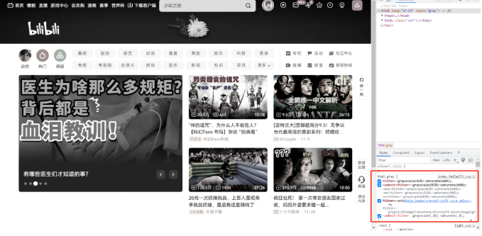

## 这几天网站都变灰了，一行代码教你实现！

这几天为了纪念伟人，所有的网站都变灰了。
作为前端开发，我们肯定想了解下网站变灰是怎么实现的。
首先打开 b 站，按 F12，看到 html 下设置的样式


把代码复制过来

```js
filter: grayscale(85%) saturate(80%);
```

然后打开没有变灰的谷歌首页

将代码复制到 html 标签下

这样就实现了变灰功能，简单吧~

这个 filter 属性是不是很神奇，我们来看看这个属性的特点：

filter 属性定义了元素(通常是'img')的可视效果(例如：模糊与饱和度)。

grayscale 将图像转换为灰度图像。值定义转换的比例。值为 100%则完全转为灰度图像，值为 0%图像无变化。值在 0%到 100%之间，则是效果的线性乘子。若未设置，值默认是 0；

saturate 转换图像饱和度。值定义转换的比例。值为 0%则是完全不饱和，值为 100%则图像无变化。其他值，则是效果的线性乘子。超过 100%的值是允许的，则有更高的饱和度。若值未设置，值默认是 1。

filter 下还有更多属性可以去改变图片的效果，感兴趣的同学可以去搜一搜看~