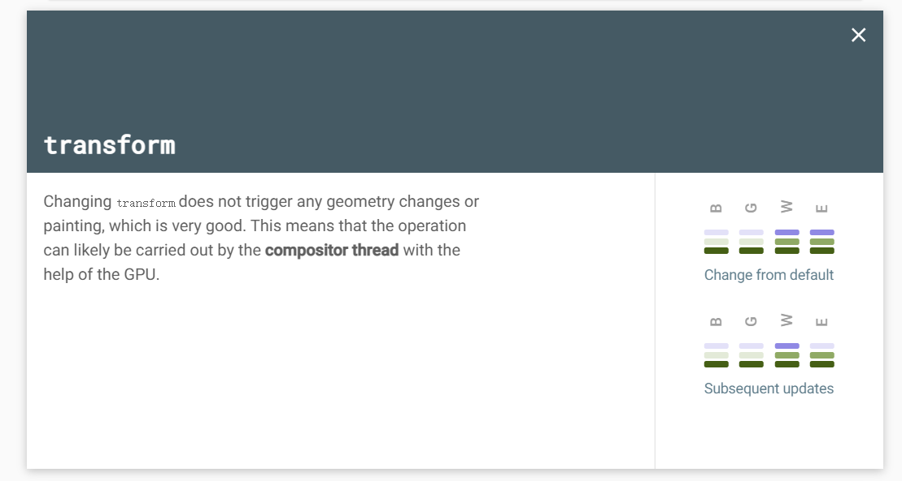
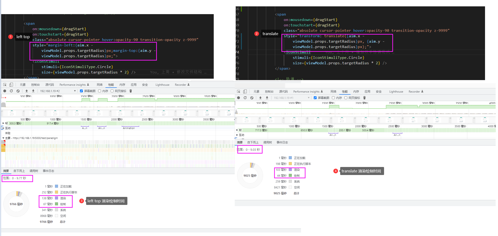

## Translate & Relative Position

```css{2-4,8}
.thing {
  position: relative;
  top: 100px;
  left: 50px;
}

.thing {
  transform: translate(50px, 100px);
}
```

以上两种写法效果相同

### 浏览器支持

position 是 CSS2 属性，而 transform 是 CSS3 属性。因此，浏览器支持存在差异，实际上唯一不支持 2D 转换的浏览器是 IE8 及更低版本。如果需要支持旧版本的 IE，transform 则不适合您。

### GPU 加速

该 transform 属性将在可能的情况下使用硬件加速，因此如果元素上还使用了任何动画或过渡，则使用 translate 将看到性能优势。

### 基于百分比的值表现不同

```css{9,14}
<div class="box position"></div>
<div class="box transform"></div>

.box {
  width: 200px;
  height: 200px;
}
.position {
  position: relative;
  left: 50%;
  background: red;
}
.transform {
  transform: translateX(50%);
  background: blue;
}
```

position 左边缘将与其父容器的边缘相距 50%
transform 左边缘将 100px 远离其父容器的左边缘。这个距离是因为 50%是 200px 是 100px

::: tip
position 和 transform 是两个不同的属性，我们可以将它们组合在一起。这允许我们结合绝对定位将元素放置在页面上非常特定的位置，然后 position 使用 transform.
:::

## 如何创建高性能动画

要在网页上显示某些内容，浏览器必须经过以下顺序步骤：

- Style：计算应用于元素的样式。
- 布局：为每个元素生成几何图形和位置。布局更改涉及计算受更改影响的所有元素的几何形状（位置和大小）。如果更改一个元素，则可能需要重新计算其他元素的几何形状。
- 绘制：将每个元素的像素填充到图层中。绘制是确定元素应以何种顺序绘制到屏幕上的过程。它通常是管道中所有任务中运行时间最长的。
- 复合：将图层绘制到屏幕上。合成是将页面分成图层、将有关页面外观的信息转换为像素（光栅化）以及将图层组合在一起以创建页面（合成）的过程。

这四个步骤被称为浏览器的渲染管道。

当在已经加载的页面上为某些内容设置动画时，必须再次执行这些步骤。此过程从必须更改以允许动画发生的步骤开始。
如上所述，这些步骤是连续的。例如，如果更改布局的内容设置动画，则绘制和合成步骤也必须再次运行。因此，动画改变布局的东西比动画只改变合成的东西更昂贵。

### 避免触发布局或绘制的属性

在将任何 CSS 属性用于动画之前（transform 和 opacity 除外），请转到[CSS 触发器](https://csstriggers.com/)以确定该属性对渲染管道的影响。除非绝对必要，否则避免触发布局或绘制的任何属性。




### 强制创建图层

正如[为什么有些动画很慢?](https://web.dev/animations-overview/) 通过将元素放置在新图层上，可以重新绘制它们，而无需重新绘制布局的其余部分。
可以使用该 will-change 属性手动强制创建图层。顾名思义，这个属性告诉浏览器这个元素将会以某种方式改变。

will-change 属性允许您提前通知浏览器您可能对元素进行哪些类型的更改，以便它可以在需要之前设置适当的优化，从而避免不小的启动成本这可能会对页面的响应能力产生负面影响。可以更快地更改和渲染元素，并且页面将能够快速更新，从而带来更流畅的体验

https://dev.opera.com/articles/css-will-change-property/

### 检查动画是否触发布局



## 参考链接

- [AtoZ CSS: Difference between Translate & Position Relative](https://www.sitepoint.com/atoz-css-translate-vs-position/)
- [How to create high-performance CSS animations](https://web.dev/animations-guide/)
