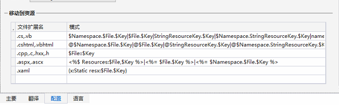

# WPF 本地化

- 用于在两个甚至更多资源文件中添加、删除、对比、检查
- 安装方式: Visual Studio 的扩展中搜索 ResxManager
- 打开方式: 右键 resx 文件->在 ResxManager 中打开
  
- 界面介绍
  
- 配置: 主要编辑 .cs 和 .xmal 扩展名的模式
  

## 引用方式

- 在每个模块中新建文件夹 Languages 并创建相应的 .resx 文件和 .zh-Hans.resx 其他语言同理，也可在 resxManager 中添加
- 使用 resxManager 打开 .resx 文件，并添加项(可导出 excel 填写完成后再导入)
- 在 resxManager 中右键 .resx 文件，修改作用域为公共访问

### xaml

在文件顶部引入命名空间，之后把需要中英文切换的文字替换

```xml
<!--引入-->
 xmlns:resx="clr-namespace:MyProject.Test.Languages"
<!--使用-->
<TextBlock Text="{x:Static resx:Name}" >
```

### csharp

```cs
// 引入
using MyProject.Test.Languages

// 使用
var name = Name;
```

> 在 xaml 页中如果有需要中英文替换的字段，可以选中该字段，右键移动到资源，弹出 ResxManager 界面，之后再 ResxManager 中填写中文字段即可，如果弹不出这个界面重启 Vs 可解决

### 语言切换

```cs
Thread.CurrentThread.CurrentUICulture = new System.Globalization.CultureInfo(isChinese ? "zh-Hans" : string.Empty);

```

## 参考资料

- [WPF: 本地化(Localization) 实现](https://www.cnblogs.com/wpinfo/p/wpf_localization.html)
- [WPF: 本地化入门](https://www.cnblogs.com/dino623/p/LocalizationWPF.html)
- [WPF 多语言解决方案 - Multilingual App Toolkit](https://yq.aliyun.com/articles/544377)
